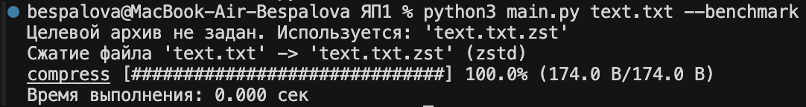
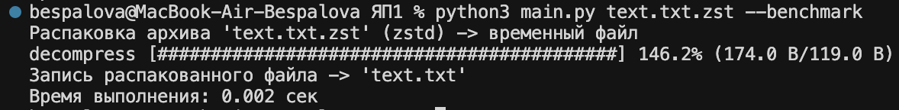
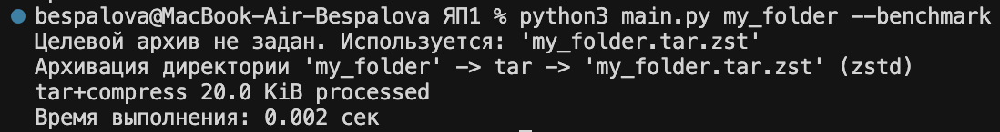
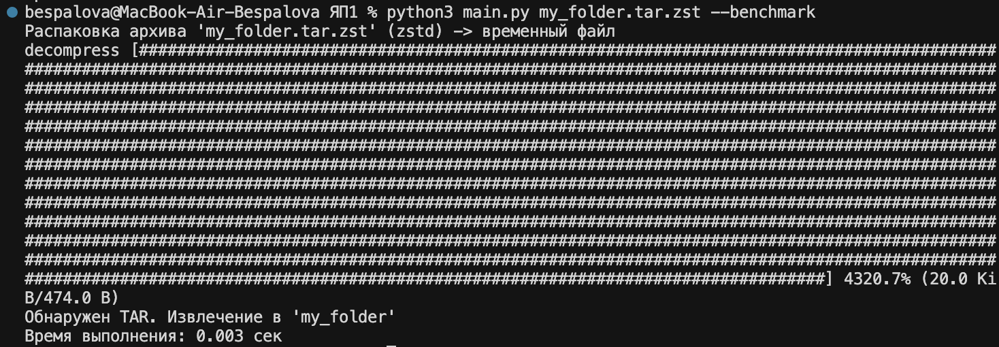

#  Архиватор на Python 3.14 (bz2 / zstd)

Поддерживает потоковое сжатие файлов и директорий.  
Формат выбирается по расширению целевого архива: `.zst` -> Zstandard, `.bz2` -> BZip2.  
Директории автоматически упаковываются в TAR перед сжатием.

---

##  Использование

```bash
python main.py <source> [destination] [--benchmark] [-x] [--level LEVEL]
```

### Параметры:
- `source` — источник: файл/директория (для сжатия) или архив (.zst/.bz2) для распаковки
- `destination` — (опционально) куда писать результат
- `-b, --benchmark` — вывести время выполнения операции
- `-x, --extract` — принудительный режим распаковки
- `--level LEVEL` — уровень сжатия для Zstandard

### Архивация файла:
```bash
python main.py text.txt --benchmark
```
#### Результат:


### Распаковка файла:
```bash
python main.py text.txt.zst --benchmark
```
#### Результат:


### Архивация директории:
```bash
python main.py my_folder --benchmark
```

#### Результат:


### Распаковка директории:
```bash
python main.py my_folder.tar.zst --benchmark
```

#### Результат:


## Структура проекта:

- `main.py` — точка входа, координация операций
- `archive.py` — основные операции архивации и распаковки
- `algorithms.py` — работа с алгоритмами сжатия (zstd, bz2)
- `args.py` — парсинг аргументов командной строки
- `display.py` — отображение прогресса операций

## Использованные модули:

- `compression.zstd` — сжатие Zstandard
- `compression.bz2` — алгоритм BZip2
- `tarfile` — упаковка/распаковка директорий
- `argparse` — CLI
- `time` — benchmark
- `os`, `sys`, `tempfile` — работа с файлами
- Потоковое копирование + прогресс-бар
